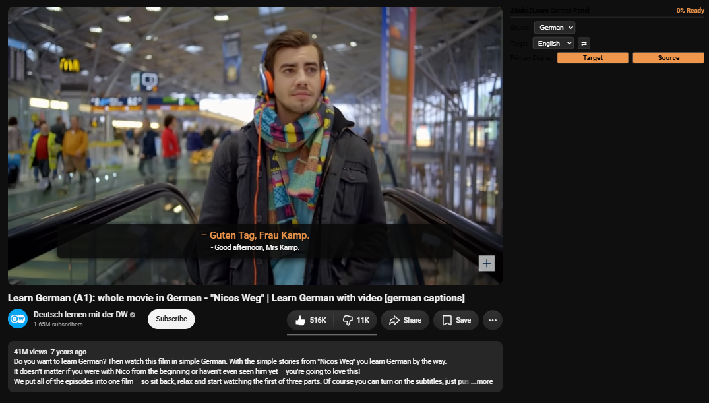

# 2Subs2Learn

## 1. What is this? Why was it developed?

**2Subs2Learn** is a powerful, lightweight browser extension designed to display dual subtitles on video streaming platforms. It was developed out of frustration with existing paid solutions (such as Intersub) that lock fundamental dual-subtitle features behind expensive subscriptions. 2Subs2Learn gives you complete freedom, utilizing local neural machine translation models to bridge language barriers seamlessly.

   

## 2. How it works

* **Sliding-Window Batch Translation:** Subtitles are grouped into performance-optimized batches, pre-fetched, and cached locally.
* **Smart Synchronization:** The video automatically syncs with custom dual-subtitle overlays. If the next translation batch is still loading, the video pauses smoothly and resumes instantly once translation finishes.
* **Local Processing:** Translations run locally via a Node.js server powered by `@xenova/transformers` and state-of-the-art transformer pipelines.

## 3. Supported Platforms

* **YouTube** (More platforms like Netflix and ZDF coming soon!)

## 4. Supported Languages

* **English ➔ German**
* **German ➔ English**
* *More language pairs coming soon!*

## 5. How to make it work

1. **Clone the repository:**
```bash
git clone https://github.com/your-username/2Subs2Learn.git
cd 2Subs2Learn

```


2. **Start the translation server:**
```bash
cd server
npm install
node server.js

```


3. **Load the extension into Chrome:**
* Open Google Chrome and navigate to `chrome://extensions/`.
* Enable **Developer mode** in the top-right corner.
* Click **Load unpacked** and select the `extension/` folder from the project directory.


## 6. Feedback & Contact

Got feedback or suggestions? Reach out here:

* Website / Contact: [theonlyalfaz.com](https://theonlyalfaz.com)